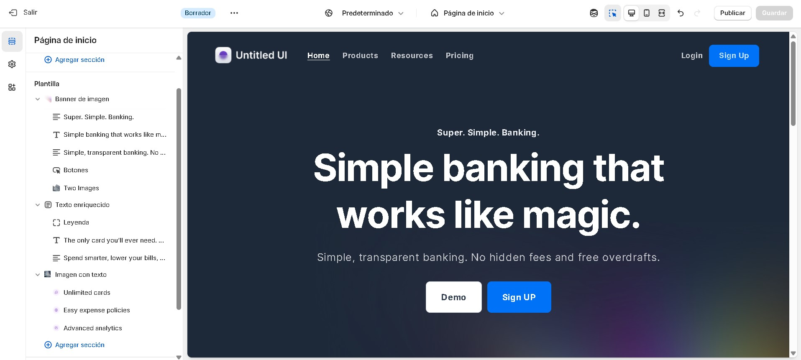
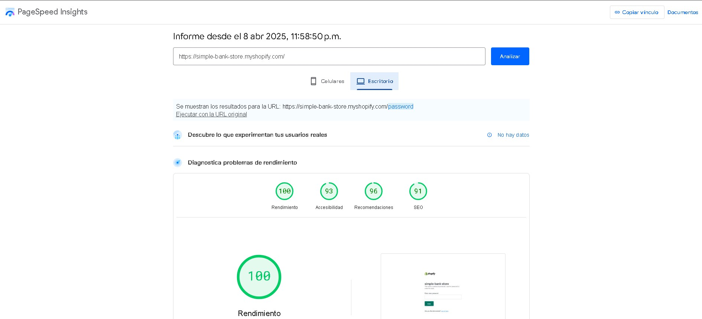
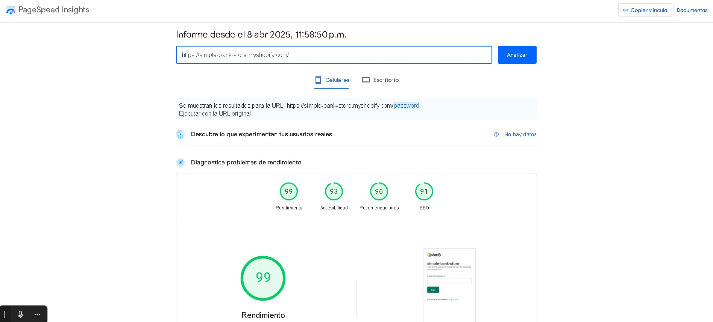

# Shopify Theme Development – Custom Sections & Performance Analysis

Este proyecto fue desarrollado como parte de un test de tema para la plataforma Shopify, enfocada en la creación de un conjunto de **secciones personalizadas** (`sections`) utilizando el **Editor Visual de Shopify** en modo de desarrollo. A continuación se documentan todos los aspectos clave del trabajo realizado, incluyendo estructura, enfoque técnico, pruebas visuales y rendimiento.

---

## Tabla de Contenidos

1. [Resumen del Proyecto](#resumen-del-proyecto)
2. [Estructura del Theme](#estructura-del-theme)
3. [Desarrollo de Secciones Personalizadas](#desarrollo-de-secciones-personalizadas)
4. [Configuración y Deploy](#configuración-y-deploy)
5. [Performance y PageSpeed Insights](#performance-y-pagespeed-insights)
6. [Capturas de Pantalla](#capturas-de-pantalla)
7. [Consideraciones Técnicas](#consideraciones-técnicas)
8. [Conclusiones](#conclusiones)

---

## Resumen del Proyecto

El objetivo principal fue extender la funcionalidad de un theme de Shopify mediante el desarrollo de secciones reutilizables (`.liquid`), totalmente configurables desde el **Theme Editor**, compatibles con dispositivos móviles y escritorio. 

Se utilizó el entorno local de Shopify con `Shopify CLI` para desarrollar, probar y compilar las secciones antes de ser desplegadas a producción.

---

## Estructura del Theme

El trabajo fue realizado sobre un theme compatible con Shopify Online Store 2.0, utilizando el template Dawn para tener el Boilerplate optimo para el theme y la facil personalizacion para el usuario final

## Desarrollo de Secciones Personalizadas

Las siguientes secciones fueron desarrolladas desde el **Editor Visual en modo desarrollo**, permitiendo una experiencia de edición sin código para usuarios finales:

### Secciones creadas:

- **Hero Banner (`hero-banner.liquid`)**  
  Imagen principal con título, descripción y botón de llamado a la acción.

- **Rich Text (`rich-text.liquid`)**  
  Bloque de texto personalizable con alineación y estilos configurables.

- **Image with Text (`image-with-text.liquid`)**  
  Componente dividido en dos columnas: imagen y contenido textual.

Todas las secciones fueron implementadas como archivos `.liquid`, soportan `schema` JSON para permitir edición desde el Theme Editor, y son `fully responsive`.

---

## Configuración y Deploy

- Se utilizó `Shopify CLI` para ejecutar el entorno local (`shopify theme dev`) y hacer `push` del theme a producción.
- La configuración del theme fue replicada en `/config/settings_data.json`, asegurando consistencia entre entornos de desarrollo y producción.
- Se mantuvo compatibilidad con el sistema de `theme settings` de Shopify para colores, tipografías y spacing global.

 
---

## Performance y PageSpeed Insights

El sitio fue evaluado usando [PageSpeed Insights](https://pagespeed.web.dev/).  
Resultados:

> ⚠️ Las métricas pueden variar dependiendo de red, tamaño de imagen y dispositivos.

---

## Capturas de Pantalla

Se incluyen capturas de pantalla para las diferentes resoluciones y layouts del sitio.

| Pantalla | Captura |
|----------|---------|
| Desktop |  |
| Mobile  | |

---

## Consideraciones Técnicas

- Se utilizó CSS moderno con `custom properties` y `media queries` para mantener un diseño fluido.
- Se corrigieron issues relacionados con `font-size` en breakpoints que generaban espacios vacíos no deseados.
- Se controló el `layout shift` visual mediante uso eficiente de imágenes y espaciado consistente.
- Las secciones se desarrollaron con `schema` JSON bien definido, siguiendo el estándar Shopify para componentes reutilizables.
- La optimizacion de imagenes se realiza en formato webp siguiendo el estandar de buenas practicas en la web
---

## Conclusiones

Este proyecto demuestra el uso avanzado del editor visual de Shopify y su CLI, combinando velocidad de desarrollo, performance y mantenibilidad del código. Las secciones creadas son completamente modulares, accesibles, responsivas y editables sin necesidad de código adicional.

